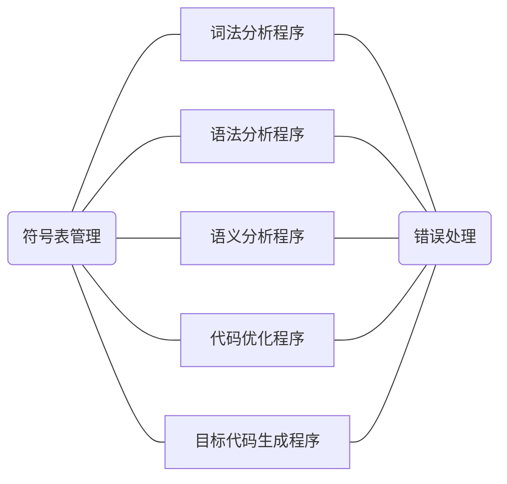
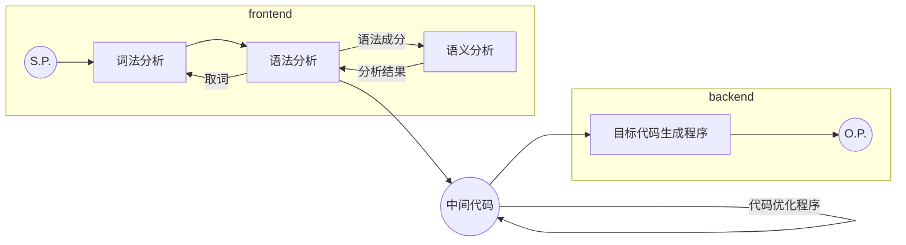

# 2019 年北航编译原理课程设计申优文档

本项目实现了一个给定文法的一遍扫描编译程序，并同步开源到 [github](https://github.com/LutingWang/Compiler) 。项目包括 $7$ 个逻辑部分

在一个学期的时间中，笔者分阶段完成了上述各个部分，并最终完成编译器的构建

本文及之后各节将以编译器设计架构为主线，详细说明在完成本次课程设计时的设计思路及相关问题的解决方法。本文之后各节以超链接形式附于本文档最后。

## 写在前面

编译原理课程设计是一门自主性较强的课设，意味着我们需要自己设计整个项目的架构和接口。一开始的作业内容还比较简单，设计难度并不大。但是进展到中间代码生成之后，设计难度开始急剧增加。这是因为中间代码和符号表的设计不仅需要便于前端程序调用，还要考虑到没有完成的后端代码。因此对于项目整体有一个清晰的认识就显得极为重要。

在项目实现时，出现不合理的设计是一定的。这时我们往往会有两种选择

1. 在已有代码的基础上进行封装或优化设计，尽量不修改原有代码
2. 对原有代码进行重构，以便从项目整体出发重新设计

本项目虽然只有 6000 行代码，但是各部分之间的依赖关系较强。所以在实际遇到这样的问题时，笔者倾向于重构。这里我们暂不讨论重构的种种风险，重构本身的确可以加深我们对于编译原理的理解、夯实编程基础。本项目在迭代过程中经历过大大小小 10 余次重构，其中最彻底的一次发生在代码优化部分。因为种种原因，笔者当时决定将符号表、词法符号等全局变量全部进行封装，应用单例设计模式。那时的编译器已经接近完成，可想重构难度之大。

为了降低重构的风险，笔者首先梳理了所有需要重构的部分，并找到他们之间的依赖关系。然后从依赖最少的部分出发，依次修改并进行回归测试。当重构完成时，笔者已经阅读了多遍代码，更加熟悉自己的项目。

-----

> 工欲善其事，必先利其器

除了设计之外，笔者认为最重要的就是熟悉 C/C++ 的编程技巧。而学习一门语言最快的方式就是阅读他人的代码和参考文档，这里推荐 [cppreference](https://en.cppreference.com/w/) 作为 API 手册。尽管 C/C++ 是较为古老的编程语言，但并不意味着某个功能一定要使用复杂而原始的方法实现。在 C++11 中已经包括了许多现代语言的特性，例如 lambda 表达式等。熟练使用这些语言特性必然可以提高编程的效率和质量。

另外，工程项目的架构规则也很重要。这里列出笔者认为最重要的几条

1. 函数或类的声明与实现分离，除了模版不要在头文件中对函数进行实现
2. 对于头文件中的重要接口给出使用注释，包括实现时引入的 feature
3. 将不同的函数分成模块保存在不同的文件中，相同文件可以组织在一个目录下
4. clean code

这些规则不仅仅可以帮助他人理解我们的项目，更重要的是记录我们自己的设计思路，不至于过一段时间就看不懂自己的代码。

-----

编译器可以算得上第一个由笔者自己设计的中型项目，能够完成到现在这个程度还是很有成就感的。整个项目从设计、实现、测试、重构到最终完成，教会了笔者许多搭建工程项目的思想与方法。积跬步以致千里，相信编译课设会成为笔者成长路上的重要基石。

## 文章链接

- [frontend](./docs/frontend.md) 
- [error](./docs/error.md) 
- [midcode](./docs/midcode.md) 
- [symtable](./docs/symtable.md) 
- [optimizer](./docs/optimizer.md) 
- [mips](./docs/mips.md) 

