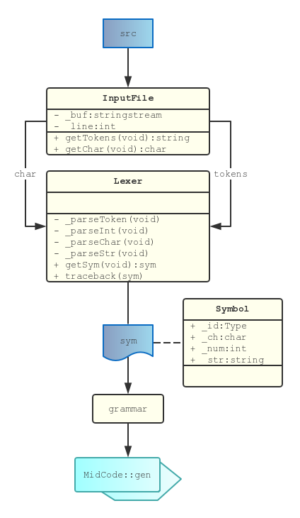

# 前端设计

[toc]

编译器前端的作用是将源程序分解为语言的各个基本语法成分，生成与其等价的源代码中间形式。本项目的前端分为词法分析、语法分析和语义分析三个阶段，如下图所示



其中 `InputFile` 是读入文件的包装类，用于简化词法分析程序的文件操作。词法分析器 `Lexer` 将文件流转化为 `Symbol` 流传入语法分析器 `grammar` 。语义分析过程没有单独函数，插入在语法分析中进行。

## 词法分析

词法分析器扫描源程序字符，按词法规则识别单词，同时进行词法检查。**单词**是语言的基本语法单位，本项目中的单词被分为以下几类

| 种类     | 属性类型 | 属性值                                                       |
| -------- | -------- | ------------------------------------------------------------ |
| IDENFR   | string   | 标志符名称                                                   |
| INTCON   | int      | 无符号整数值                                                 |
| CHARCON  | char     | 字符常量                                                     |
| STRCON   | string   | 字符串常量                                                   |
| RESERVED | Reserved | CONSTTK, INTTK, CHARTK, VOIDTK, MAINTK, IFTK, ELSETK, DOTK, WHILETK, FORTK, SCANFTK, PRINTFTK, RETURNTK |
| DELIM    | Delim    | ASSIGN, SEMICN, COMMA, LPARENT, RPARENT, LBRACK, RBRACK, LBRACE, RBRACE |
| OPER     | Oper     | PLUS, MINU, MULT, DIV                                        |
| COMP     | Comp     | LSS, LEQ, GRE, GEQ, EQL, NEQ                                 |

词法分析的每次调用会读取一个单词并将其存入全局变量 `sym` 供 `grammar` 分析。

## 语法分析

语法分析根据文法分析并识别出各种语法成分，并进行正确性检查。本项目实现的是自顶向下的递归下降分析法。这一方法对文法的要求较高，因此需要改写原文法为 `LL(1)` 文法，后续过程就比较容易实现了。改写后的文法如下

```
<程序>				::= <常量说明><变量说明><函数说明>
	<常量说明>		::= {const<常量定义>;}
		<常量定义> 	::= int<标识符>=<整数>{,<标识符>=<整数>}|char<标识符>=<字符>{,<标识符>=<字符>}
	<变量说明>		::= {<类型标识符><变量定义>;}
		<变量定义> 	::= <标识符>[<下标>]{,<标识符>[<下标>]}
			<下标>	::= '['<无符号整数>']' // <无符号整数>表示数组元素的个数，其值需大于0
	<函数说明>		::= {(<类型标识符>|void)<函数定义>}void<主函数>
		<函数定义>	::= <标识符>'('<参数表>')'<复合语句>
			<参数表>	::= [<类型标识符><标识符>{,<类型标识符><标识符>}]
		<主函数>		::= main'('')'<复合语句>

<复合语句>			::= '{'<常量说明><变量说明>{<语句>}'}'
<语句>				::= <条件语句>|'{'{<语句>}'}'|<函数调用语句>;|<赋值语句>;|<读语句>;|<写语句>;|<返回语句>;|;
	<条件语句>	::= <if语句>|<while语句>|<do语句>|<for语句>
		<if语句>		::= if'('<条件>')'<语句>[else<语句>]
		<while语句>	::= while'('<条件>')'<语句>
		<do语句>		::= do<语句>while'('<条件>')'
		<for语句>	::= for'('<标识符>=<表达式>;<条件>;<标识符>=<标识符><加法运算符><无符号整数>')'<语句>
			<条件>	::= <表达式>[<关系运算符><表达式>] // 表达式为0条件为假，否则为真
	<函数调用语句>	::= <标识符>'('[<表达式>{,<表达式>}]')'
	<赋值语句>		::= <标识符>['['<表达式>']']=<表达式>
	<读语句>			::= scanf'('<标识符>{,<标识符>}')'
	<写语句>			::= printf'('<字符串>[,<表达式>]')'|printf'('<表达式>')' 
	<返回语句>		::= return['('<表达式>')']

<表达式>				::= [<加法运算符>]<项>{<加法运算符><项>} // [+|-]只作用于第一个<项>
<项>				::= <因子>{<乘法运算符><因子>}
<因子>				::= <标识符>['['<表达式>']']|'('<表达式>')'|<整数>|<字符>|<函数调用语句>
<整数>				::= [<加法运算符>]<无符号整数>

<标识符>		::= <字母>{<字母>|<数字>}
<无符号整数> 	::= <非零数字>{<数字>}|0
	<数字>		::= 0|<非零数字>
	<非零数字>	::= 1|...|９
<字符>		::= '<加法运算符>'|'<乘法运算符>'|'<字母>'|'<数字>'
<字符串>		::= "{十进制编码为32,33,35-126的ASCII字符}"
<类型标识符> 	::= int|char
<加法运算符>	::= +|-
<乘法运算符> 	::= *|/
<关系运算符> 	::= <|<=|>|>=|!=|==
<字母>		::= _|a|...|z|A|...|Z
```

此处为了与递归下降程序对接，采用了缩进和重排，仅作为示例。

## 语义分析

语义分析对语法树进行语义分析，产生相应的中间代码。本项目采用属性翻译文法实现语义分析。一般来说将文法改写成属性翻译文法比较容易，值得一提的是 while 语句的属性翻译文法

```
<while语句>	::= while'('<条件>')'<语句>
```

直观来看应该被翻译成如下语句

```cpp
label1:
if !<条件> goto label2
	<语句>
goto label1
label2:
```

但是对于一个执行了 `n` 次的循环，这样的语句要执行 `n` 次分支和 `n` 次跳转。如果翻译成下面的形式就只需要执行 `n` 次分支和 `1` 次跳转

```cpp
goto label2
label1:
	<语句>
label2:
if <条件> goto label1
```

看起来效率提高了许多，但是这仍然不是最优情况

```cpp
if !<条件> goto label1
label1:
	<语句>
if <条件> goto label1
label2:
```

这样对于一个执行了 `n` 次的循环，就只需要执行 `n` 次分支。上面的讨论对 for 循环同样适用。