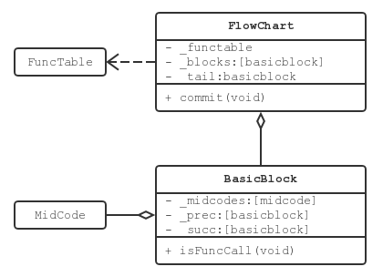

# 中间代码设计与生成

[toc]

中间代码和符号表是编译器中仅有的两个贯穿前后端的功能模块。和函数中的局部变量类似，中间代码也是分函数保存的，而且出现在不同位置的两条中间代码不能共用同一个底层对象。因此项目实现时将中间代码和局部变量一并保存在符号表中，以减少代码冗余。

## 数据结构

中间代码在程序中用一个五元组表示

```cpp
const Instr _instr;			// operation
const symtable::Entry* const _t0;	// result variable
const symtable::Entry* const _t1;	// operand1
const symtable::Entry* const _t2;	// operand2
const std::string* _t3;		// label name
```

对于不同的中间代码，可能会使用到不同的成员变量。在初始化中间代码时，构造函数保证对于描述某一个指令的中间代码，其不使用的成员变量一定会被赋值为 `nullptr` 。成员变量的使用情况列在下方

```cpp
enum class Instr {
  ADD,		// t0 = t1 + t2
  SUB,		// t0 = t1 - t2
  MULT,		// t0 = t1 * t2
  DIV,		// t0 = t1 / t2
  LOAD_IND,	// t0 = t1[t2]
  STORE_IND,	// t0[t2] = t1
  ASSIGN,		// t0 = t1

  PUSH_ARG,	// push t1
  CALL,		// t0(nullable) = call t3
  RET,		// return t1(nullable)

  INPUT,		// scanf(t0)
  OUTPUT_STR,	// printf(t3)
  OUTPUT_INT,	// printf(t1)
  OUTPUT_CHAR,    // printf(t1)

  BGT,		// branch to t3 if t1 > t2
  BGE,		// branch to t3 if t1 >= t2
  BLT,		// branch to t3 if t1 < t2
  BLE,		// branch to t3 if t1 <= t2
  BEQ,		// branch to t3 if t1 == t2
  BNE,		// branch to t3 if t1 != t2
  GOTO,		// goto t3
  LABEL		// lab t3
};
```

其中标注 nullable 的域是可以合法传入 `nullptr` 的，否则不能为空。而且中间代码是不可变对象，已经构造就无法更改，从另一方面保证了中间代码的合法性。

## 代码生成

中间代码所属的 `MidCode` 类不仅是一个中间代码的容器，同时也是中间代码生成的工具类。为了实现这一目的 `MidCode` 定义了一组 `gen` 函数用于包装对符号表的操作

```cpp
private:
    // If error happened or the current function being parsed has
    // already returned, do nothing. Otherwise push the `MidCode`
    // into symtable.
	static void _gen(const MidCode* const);
public:
	static void gen(const Instr, 
			const symtable::Entry* const, 
			const symtable::Entry* const, 
			const symtable::Entry* const);

	static void gen(const Instr, 
			const symtable::Entry* const, 
			const symtable::Entry* const, 
			const symtable::Entry* const, 
			const std::string&);

	// naming convension:
	//     #1		- temporary variable
	//     int$0	- global int constant
	//     char$0	- global int constant
	//     label$1	- non-functional labels
	static const symtable::Entry* genVar(const bool);
	static const symtable::Entry* genConst(const bool, const int);
	static std::string genLabel(void);
```

这样就保证前端在生成中间代码时不需要申请过多的符号表权限，而是交给 `MidCode` 统一代理。不仅保证了符号表的安全性，更简化了前端的操作。

## 基本块与流图

将中间代码划分为基本块并搭建流图是后续代码优化和目标代码生成的基础。其算法与书上一致，这里不过多说明，只介绍设计思路。



搭建流图的很重要一点在于，代码优化的时候需要直接通过流图修改中间代码。否则优化器需要回到符号表定位相应代码，时间开销太大。但是中间代码是保存在符号表中的，通过流图所做的修改最终还是要写回符号表。为了简化这里的操作，项目将符号表的中间代码在流图中做了一次备份。从这时起，符号表中的中间代码就是过时的了，再次访问有可能导致错误。当优化器修改完中间代码，需要手动调用 `FlowChart::commit()` 函数将流图写回中间代码。如果忘记写回，则会导致修改丢失。

但是这样设计最大的问题是符号表的访问限制可能被流图绕过。因此在符号表中加入接口

```cpp
private:
  // Interface overloading to retrieve mutable func set.
	void funcs(std::set<symtable::FuncTable*>&, bool) const;
public:
	void funcs(std::set<const symtable::FuncTable*>&) const;
```

用于区分不同类的访问权限。例如 `Optim` 是 `SymTable` 的友元类，因此可以访问 private 的 `funcs` 函数，并接收可变的 `FuncTable` 对象。根据这个对象去构建流图是可以写回的。但是对于 `mips` 中的类，他们只能访问 public 的 `funcs` 函数，所以接受到的 `FuncTable` 对象是不可变的，因此对应的流图也是不可写回的。这样就解决了中间代码访问权限的问题。