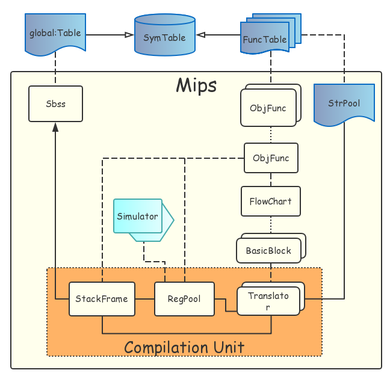

# MIPS 目标代码生成

目标代码生成主要由 4 个部分组成

| 类名         | 功能描述                                       |
| ------------ | ---------------------------------------------- |
| `StrPool`    | 管理程序中需要输出的字符串，生成对应的标签     |
| `ObjFunc`    | 翻译单个函数的中间代码，保存生成的目标代码序列 |
| `RegPool`    | 管理函数的寄存器池，在目标代码需要时设置寄存器 |
| `StackFrame` | 管理函数的栈帧，生成访存指令                   |

这三个对象由统一的对外接口 `mips` 进行调用。接口功能包括

```cpp
void init(void);
void deinit(void);
void output(void);
```

其中，中间代码到目标代码的翻译工作主要在 `init` 函数中完成。

## 项目架构

子项目整体架构如图



翻译过程的大致流程是

1. 初始化 `Sbss` 
2. 初始化 `StrPool`
3. 对每个 `FuncTable` 初始化相应的 `ObjFunc`

除 `ObjFunc` 以外的部分都有详细的注释，因此这里不再赘述。

## ObjFunc

`ObjFunc` 是整个翻译过程的核心。对于单个 `FuncTable` 对象的翻译过程如下

1. 初始化 `StackFrame`
2. 初始化 `RegPool`
3. 初始化 `Translator`
4. 以基本块为单位翻译

初始化的顺序需要严格保证，因为 `RegPool` 需要 `StackFrame` 来进行访存，而 `Translator` 需要 `RegPool` 和 `StackFrame` 来翻译全部代码。在第 4 步中，之所以以基本块为翻译单位，是因为函数调用这一基本块需要特殊处理。对于不是函数调用的基本块，可以以单条中间代码为单位进行翻译。

## RegPool

寄存器池的主要功能是在程序需要某个变量时，确保这个变量位于寄存器中，并返回寄存器编号。如果在程序请求某个变量时，这个变量不再寄存器中，则需要借由 `StackFrame` 将变量从内存中调入特定寄存器。为了尽量减少程序的访存操作，就需要尽可能保证程序所需要的变量在寄存器中，这里涉及到两种寄存器分配策略。

### t 寄存器的分配

临时寄存器的特点是随用随取，类似操作系统中页面置换的过程。本项目中使用的分配策略是 OPT 算法，也就是每次将最久不会被使用的寄存器换出。这一策略需要提前变量的调用顺序等信息，由 `Translator` 提供。基于此，寄存器池使用 `Simulator` 来模拟寄存器分配，并将模拟过程中模拟器的 `Action` 记录下来。当 `Translator` 申请某个变量时，只需要将之前记录的行为执行一次，然后返回相应的寄存器即可。

### s 寄存器的分配

目前全局寄存器使用引用计数法进行分配。

## 目标代码结构

`mips::output()` 函数用于输出翻译后的目标代码。输出目标代码的流程如下

1. 生成 `.data` 标签
2. 生成字符串标签
3. 生成 `.text` 标签
4. 生成全局语句块
5. 对每个 `ObjFunc` 生成函数名标签并调用 `output`

输出的目标代码如下

```mips
.data
str$0: .asciiz ""
# ...

.text
jal main
li $v0 10
syscall

main:
# ...

func1:
# ...
```
