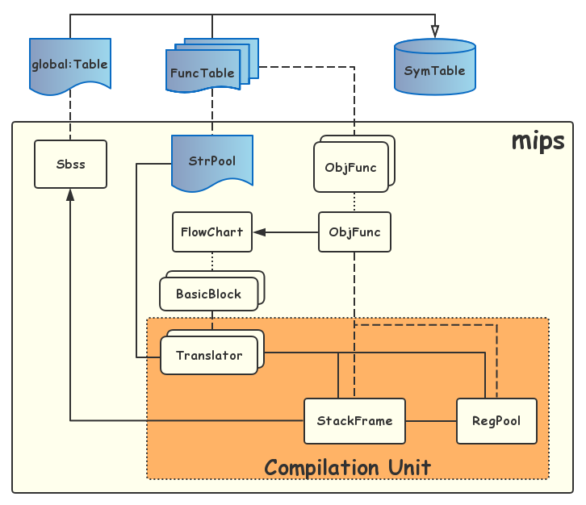

# MIPS 目标代码生成

## ObjCode

在编译器中，目标代码使用 `struct ObjCode` 进行描述。与中间代码不同的是， `ObjCode` 没有一个单独的成员用于表示指令类型，而是使用子类类型来进行区分。但与中间代码类似，所有继承自 `ObjCode` 的子类对象都是不可变的，在一定程度上降低了优化目标代码的风险。目标代码的设计上，本项目采用了工厂设计模式


由于空间问题，具体的指令类没有在图中画出。采用这样的设计不仅可以降低生成目标代码所需要的代码量，更重要的是可以通过相同的借口灵活选用更为高效的目标代码。举例来说，对于中间代码中的条件判断语句

```cpp
if a == b goto label
```

调用者只需要将 `a` 和 `b` 分别传入 `BranchFactory` 即可

```cpp
BranchFactory::produce(a, b, label);
```

而不必关心这条中间代码实际是如何翻译的。一般来说，对于两个寄存器类型的操作数 `a` 和 `b` ，翻译出的目标代码应该是

```mips
seq $t8, a, b
bnez $t8, label
```

但如果其中一个寄存器是 `$zero` （不妨设为 `b` ），那么上面的翻译方式就不那么高效了。合理的翻译方式应该是

```mips
beqz a, label
```

比之前的情况省去了一条 ALU 指令。而要实现这样的功能，只需要修改 `BranchFactory::produce` 的实现即可，调用者完全不需要更改。

下表给出了本项目支持的全部目标代码指令

| 指令名称  | 类别                    | 特化模版类 | 特化输出              |
| --------- | ----------------------- | ---------- | --------------------- |
| `add`     | `RCode` & `PseudoRCode` |            |                       |
| `sub`     | `RCode` & `PseudoRCode` |            | （ `PseudoRCode` ）是 |
| `mul`     | `RCode` & `PseudoRCode` |            |                       |
| `div`     | `RCode` & `PseudoRCode` |            | 是                    |
| `move`    | `RCode`                 | 是         |                       |
| `syscall` | `RCode`                 | 是         |                       |
| `neg`     | `RCode`                 |            |                       |
| `mflo`    | `RCode`                 |            |                       |
| `nop`     | `RCode`                 | 是         |                       |
| `lw`      | `ICode`                 |            |                       |
| `sw`      | `ICode`                 |            |                       |
| `sll`     | `ICode`                 |            | 是                    |
| `li`      | `ICode`                 | 是         |                       |
| `j`       | `JCode`                 |            |                       |
| `jal`     | `JCode`                 |            |                       |
| `jr`      | `JCode`                 | 是         |                       |
| `label`   | `JCode`                 |            | 是                    |
| `bgt`     | `BCode` & `PseudoBCode` |            |                       |
| `bge`     | `BCode` & `PseudoBCode` |            |                       |
| `blt`     | `BCode` & `PseudoBCode` |            |                       |
| `ble`     | `BCode` & `PseudoBCode` |            |                       |
| `beq`     | `BCode` & `PseudoBCode` |            |                       |
| `bne`     | `BCode` & `PseudoBCode` |            |                       |
| `bgtz`    | `BZCode`                |            |                       |
| `bgez`    | `BZCode`                |            |                       |
| `bltz`    | `BZCode`                |            |                       |
| `blez`    | `BZCode`                |            |                       |
| `beqz`    | `BZCode`                |            |                       |
| `bnez`    | `BZCode`                |            |                       |
| `la`      | `BZCode`                |            |                       |

这些指令对于翻译本次给定的文法已经足够了。如果需要更多指令的支持，只需要增加一个新的指令类，继承相应父类即可。需要注意的是，注释通过 `Label` 输出，只需要保证 `label` 的第一个字符是 # 即可。

## 项目架构

目标代码生成器主要由 4 个部分组成

| 类名         | 功能描述                                       |
| ------------ | ---------------------------------------------- |
| `StrPool`    | 管理程序中需要输出的字符串，生成对应的标签     |
| `ObjFunc`    | 翻译单个函数的中间代码，保存生成的目标代码序列 |
| `RegPool`    | 管理函数的寄存器池，在目标代码需要时设置寄存器 |
| `StackFrame` | 管理函数的栈帧，生成访存指令                   |

这三个对象由统一的对外接口 `mips` 进行调用。接口功能包括

```cpp
void init(void);
void deinit(void);
void output(void);
```

其中，中间代码到目标代码的翻译工作主要在 `init` 函数中完成

```cpp
void mips::init(void) {
    Sbss::init();
    strpool.init();
    ObjFunc::init();
}
```

子项目整体架构如图



贯穿整个翻译过程存在的变量是 `Sbss` 和 `StrPool` ，这两个对象会辅助 `ObjFunc` 的编译。

## ObjFunc

可以看出 `ObjFunc` 是翻译过程的核心。在 `ObjFunc::init()` 中会针对每个 `FuncTable` 建立一个翻译单元，然后调用翻译单元中 `Translator::compile()` 方法逐个翻译每个 `BasicBlock` 。对于单个 `FuncTable` 对象的翻译过程如下

1. 初始化 `StackFrame`
2. 初始化 `RegPool`
3. 初始化 `Translator`
4. 以基本块为单位翻译

初始化的顺序需要严格保证，因为 `RegPool` 需要 `StackFrame` 来进行访存，而 `Translator` 需要 `RegPool` 和 `StackFrame` 来翻译全部代码。在第 4 步中，之所以以基本块为翻译单位，是因为函数调用这一基本块需要特殊处理。对于不是函数调用的基本块，可以以单条中间代码为单位进行翻译。

## RegPool

寄存器池用于管理寄存器及其存储的变量。这些寄存器可以大致分为 a 寄存器、 t 寄存器以及 s 寄存器。


寄存器池的主要功能是在程序需要某个变量时，确保这个变量位于寄存器中，并返回寄存器编号。如果在程序请求某个变量时，这个变量不再寄存器中，则需要借由 `StackFrame` 将变量从内存中调入特定寄存器。为了尽量减少程序的访存操作，就需要尽可能保证程序所需要的变量在寄存器中，这里涉及到两种寄存器分配策略。

### t 寄存器的分配

临时寄存器的特点是随用随取，类似操作系统中页面置换的过程。本项目中使用的分配策略是 OPT 算法，也就是每次将最久不会被使用的寄存器换出。这一策略需要提前变量的调用顺序等信息，由 `Translator` 提供。当需要从 t 寄存器中读取一个变量 `a` 时，寄存器池按顺序进行检索

1. 如果 `a` 已经存在于 t 寄存器中，返回其所在的寄存器编号
2. 如果某个 t 寄存器没有存储变量，返回该寄存器编号
3. 根据 OPT 算法找到一个被换出的变量，选择性写回后，将 `a` 存入该寄存器并返回

在第 3 步中，如果 t 寄存器中当前的变量没有被读取过，则变量的值应该和内存中对应位置存储的值相等，因而不需要写回。为了记录这一信息，需要 `Translator` 每次请求寄存器的同时指出，请求寄存器的这个变量的值会不会被修改。

另外，考察中间代码到目标代码的翻译过程可以看出，在某次请求寄存器时 OPT 算法的结果可能会导致错误。举例来说，翻译形如

```cpp
c = a + b;
```

的中间代码时，需要先后请求两个寄存器用于保存 `a` 和 `b` 。对于第一次请求，寄存器池可以正常进行分配。但在第二次请求时，变量 `a` 已经不在寄存器池的后续变量使用序列中了。变量 `b` 完全可以被分配到变量 `a` 占据的寄存器。为了避免这种情况，寄存器池需要知道某个请求是否需要屏蔽上次分配出去的寄存器。在这个例子中，假设变量 `a` 占据的寄存器是 `$t0` 则寄存器池中的 `_maskCache` 应该被设为 `$t0` 。在第二次请求时 `Translator` 会告知寄存器池屏蔽上次的分配结果，于是 `$t0` 不再允许被分配。

### s 寄存器的分配

全局寄存器用于保存函数内部最常用的一组变量。在整个函数体内，全局寄存器不需要写回堆栈，因此可以消除大部分访存指令。但是注意到全局变量不可以被分配全局寄存器，否则在函数调用时会导致全局变量的值会产生错误。因此全局变量只能通过 t 寄存器进行读写。下文中出现的全局一词均指 s 寄存器，而非全局变量。

全局寄存器的分配策略主要有引用计数和图着色算法两种。其中引用计数算法比较简单，而且在程序迭代过程中已经被删去，这里不再赘述。图着色算法主要依赖数据流信息，将 s 寄存器分配给尽可能多的变量。本项目中首先使用活跃变量数据流，分析程序中所有变量的冲突情况，构建冲突图；而后使用图着色算法对冲突图着色，从而分配 s 寄存器。

为了方便描述变量间的冲突关系，项目中使用 `map<entry, set<entry>>` 来建模冲突图

```cpp
class ConflictGraph {
    using Node = const symtable::Entry;
    using Graph = std::map<Node*, std::set<Node*>>;
    
    Graph _graph;
public:
    ConflictGraph(const FlowChart&, const std::vector<Node*> blackList);
    
private:
    static void _removeNode(Graph&, Node* const);
public:
    void color(std::map<Node*, Reg>&) const;
};
```

因为函数中的局部变量都可以保证先赋值后引用，因此在函数入口处不需要调入局部变量。但是函数参数会在函数跳转前被赋值，而且被保存在栈帧中，和其他局部变量的使用规律不同。为了实现方便，本项目将函数参数全部作为 `blackList` 传入冲突图，从而避免参数被分配到 s 寄存器。一般情况下（参数个数不超过 12 个），这种做法不会引起很大的性能损失。因为 t 寄存器仍然可以起到优化作用，而且空余的 s 寄存器可以分配给其他非参数变量。

## 存储分配

因为文法中并没有提供内存的动态管理语句，因此对于每个函数而言，其存储分配都是静态的。也就是说，函数的栈帧结构在每次调用时都是相同的。项目中使用 `StackFrame` 

## 目标代码结构

`mips::output()` 函数用于输出翻译后的目标代码。输出目标代码的流程如下

1. 生成 `.data` 标签
2. 生成字符串标签
3. 生成 `.text` 标签
4. 生成全局语句块
5. 对每个 `ObjFunc` 生成函数名标签并调用 `output`

输出的目标代码如下

```mips
.data
str$0: .asciiz ""
# ...

.text
jal main
li $v0 10
syscall

main:
# ...

func1:
# ...
```
