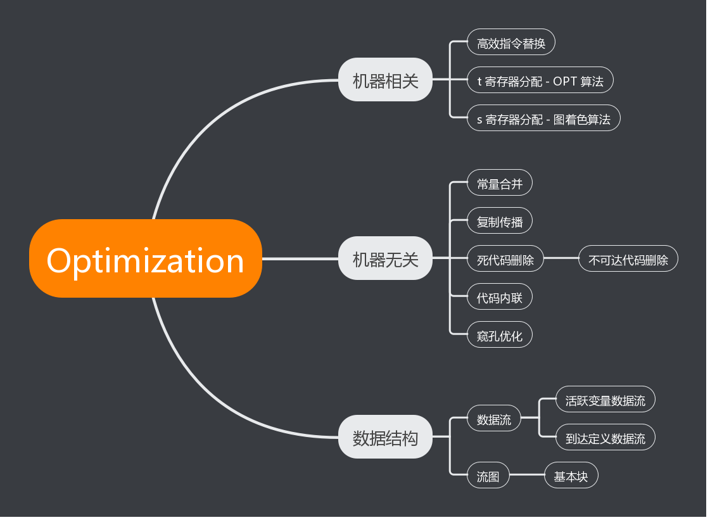

# 代码优化

[toc]

本节主要介绍项目中应用的机器无关代码优化技术。机器相关代码优化技术在 mips 一节中会进行详细介绍。纵观整个项目，实现的优化相关技术如下图



## 数据流分析

流图与基本块的架构已经在 midcode 一节中介绍过，因此本文不再说明。作为优化的另一个基本的数据结构，数据流在本节中起到了和流图类似的重要作用。数据流分析方法可以用来获取数据如何在程序执行路径中流动等相关信息，是许多全局优化方法的基础。

### 活跃变量数据流

相比于到达定义数据流，活跃变量比较容易分析。改写书上列出的分析算法可以得到

1. 计算每个基本块的 use & def
2. 将基本块的 in 初始化为 use
3. 对于每个基本块，根据数据流方程计算 out 并更新 $in = in \cup (out - def)$ 
4. 检查第三步中是否有更新。若有则跳回第三步，否则结束

改写后的算法不仅省去了第一次循环，而且不必存储 use 信息，在一定程度上可以提高效率。最终得到的数据流是一个字典

```cpp
std::map<const BasicBlock*, Vars> _out;
```

其中 `Vars` 表示活跃变量的集合

```cpp
using Vars = std::set<const symtable::Entry*>;
```

事实上，在一般的活跃变量数据流中可以只存储 out 对应的基本块编号，而不必使用 map 。这样设计主要是因为实际应用中常常需要反推每条中间代码的 out 。而如果不知道某个 `Vars` 对应的基本块，就难以实现这个功能。因此在存储时记录的是 `<basicblock, vars>` 这一二元组。

### 到达定义数据流

到达定义数据流和活跃变量数据流类似，但到达定义数据流的基本单位是中间代码。也就是说对应于 `Vars` 的 `Defs` 应该有如下形式

```cpp
using Defs = std::set<const MidCode*>;
```

类似地可以改写更新算法得到

1. 计算每个基本块的 gen 存储到 blockGens
2. 计算整个函数的 gen 存储到 funcGen
3. 根据 blockGens 和 funcGen 计算每个基本块的 kill
4. 将基本块的 out 初始化为 gen
5. 对于每个基本块，根据数据流方程计算 in 并更新 $out = out \cup (in - kill)$ 
6. 检查第三步中是否有更新。若有则跳回第三步，否则结束

与活跃变量的算法不同，到达定义数据流在计算每个基本块的 kill 时需要函数整体的 gen 信息。对于单个基本块来说，可能在基本块间流动的定义点是同一个变量在这个基本块中的最后一个定义点。因此 blockGens 可以用 map 来表示

```cpp
std::vector<DefMap> blockGens(blocks.size());
```

其中 `DefMap` 定义为

```cpp
using DefMap = std::map<const symtable::Entry*, const MidCode*>;
```

而对于函数整体，某个变量可能存在多个定义点，因此定义 `funcGen`

```cpp
std::map<const symtable::Entry*, Defs> funcGen;
```

有了局部和整体的 gen 信息，基本块就可以计算出它的 kill 。后续过程和活跃变量数据流类似，这里不再赘述。

## 常量合并

常量合并是将能在编译时计算出值的表达式用其相应的值替代。例如中间代码

```
a = 1 + 2;
```

就可以被替换为

```
a = 3
```

这样做看似毫无意义（因为计算指令和赋值语句消耗的时间是相同的），但是一旦辅以复制传播和死代码删除，这个优化的作用将是巨大的。

除了书中提到的计算类指令，跳转指令也可以被替换。例如

```
if 1 > 2 branch to label1
```

很显然这样的语句是没有实际效果的，可以直接被删除。而如果将指令中的立即数 `1` 和 `2` 互换

```
if 2 > 1 branch to label1
```

则这条指令可以等效为一个 `GOTO` 。和之前一样，尽管 `GOTO` 和 `branch` 需要消耗同样的时间，但这样修改可以减少这条中间代码所在基本块的后继块的数量，从而提高其他优化的效率。

值得注意的是，因为本项目中的中间代码是不可变对象，所以在替换时需要先析构，然后再构造新的中间代码替换过去。这样做会降低编译器的运行效率，但却是保证中间代码有效性的必要措施。

## 复制传播

如果代码中有形如

```
a = b
```

的变量复制语句，则在后续 `a` 的使用点上，可以用 `b` 来代替 `a` 。首先看基本块内的情况。假设我们分析的是一个没有前驱的基本块，也就是说没有其他定义点可以到达这个基本块。那么可以使用一个 matcher 来记录这个基本块内部的变量对应情况

```cpp
std::map<const symtable::Entry*, const symtable::Entry*> _matches;
```

完整的算法如下

1. 初始化 matcher 为空
2. 对于每一条中间代码，循环执行 3 & 4 两步
3. 如果中间代码使用的变量 `b` 在 matcher 中存在映射，则将 `b` 替换
4. 如果中间代码是复制语句，则修改 matcher 的映射关系；否则如果中间代码定义了变量 `a` 则清除 `matcher` 中和 `a` 有关的全部关系

算法的前三步很好理解，主要难点在于第四步。如果存在对应关系

```
c -> a
a -> d
```

此时中间代码 `a = 1` 定义了变量 `a` 则这两个关系都应该删除，同时生成新关系

```
c -> d
```

因此删除映射关系的算法如下

1. 检索 matcher 的全部映射，如果 `a` 出现在映射的右侧，则将其标记
2. 如果 `a` 在 matcher 中映射到 `b` ，则将所有被标记的映射中的 `a` 换成 `b` ，否则删除之
3. 删除 `a` 在 matcher 中的映射

修改映射关系建立在删除的基础之上，其算法如下（设修改后的映射是 `a -> b`）

1. 删除 matcher 中和 `a` 有关的全部关系
2. 建立映射关系 `a -> b`

## 死代码删除

有了活跃变量数据流的支持，死代码删除就比较容易了。只要判断每条中间代码定义的变量是否在当前定义点是活跃的即可。但是有一些特殊情况，即使被定义的变量不活跃，中间代码也不能被删除。这些特殊情况有

- 被定义变量是全局变量
- 中间代码是函数跳转
- 中间代码是输入操作

因为活跃变量数据流中并不包含全局变量，使得第一种情况被误判的可能性大大提高。但是只要仔细推导，这些问题还是比较容易避免的。

## 不可达代码删除

严格来说不可达代码的删除并不属于本次优化的范畴，因为不可达代码不会占用指令数量。但是从编译器设计角度来看，不可达代码的删除对于提高编译速度和压缩代码空间有极为显著的作用。本节中讨论的不可达代码主要有以下几种

1. 已经被内联的函数
2. `return` 语句之后代码
3. 流图中的不可达基本块
4. 没有跳转指令跳到的标签

事实上条件 2 是条件 3 的一个特例，但是条件 2 是在前端判断的，而条件 3 在优化器中判断，因此此处将其拆分成两种情况。对于不再上述 4 种情况中的代码，本项目都保守的认为其可达。

## 函数内联

函数内联是编译器优化的普遍做法之一。一般的编译器会考虑函数的指令数量是不是足够少，以至于内联的效果比较显著而且不会给代码存储造成负担。但是在本项目中主要追求运行速度，因此对于所有可以内联的函数都进行了默认内联。这里所说的可内联函数是指非递归函数。尽管正常的编译器并不会这样判断，但在我们的文法中，非递归这一条件等价于可内联。

代码内联的核心思想是将函数体复制到函数的被调用处，从而节省函数跳转时保存现场的开支。具体算法如下

1. 对于每个函数调用基本块，检查被调用函数