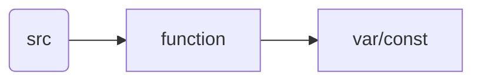
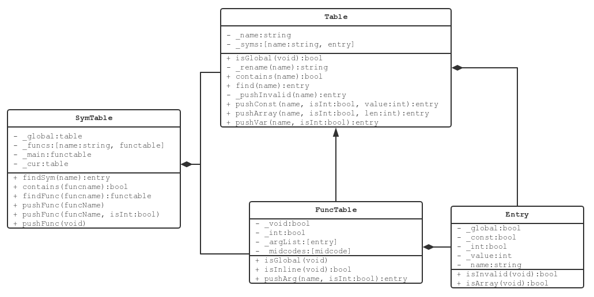

# 符号表管理

[toc]

符号表的功能是管理源程序中的各种符号，并存储必要的信息。根据文法可以大致将符号表分为三个层次



源程序中包含多个函数（全局作用域视为一个特殊的函数），每个函数包括若干变量或常量。类比数据库，则源程序就是 database ，函数就是 table，而变量是 entry 。项目实现时也是基于这样的类比



## Entry

符号表中最基本的条目是 `Entry` ，用于描述一个变量或常量。 `Entry` 中各个域的取值参见 `symtable.h` 的注释

```cpp
// symtable.h
//
// + type           _const      _int        _value
// - const int      (true,      true,       int_val)
// - const char     (true,      false,      char_val)
// - int            (false,     true,       NOT_ARRAY)
// - int[]          (false,     true,       array_len)
// - char           (false,     false,      NOT_ARRAY)
// - char[]         (false,     false,      array_len)
// - invalid        (false,     true,       INVALID)
```

其中 `NOT_ARRAY` 和 `INVALID` 用于标识特定的 `Entry` 类型，外部不需要知道其具体取值。

## Table & FuncTable

`Table` 类用于保存变量名到 `Entry` 对象的对应关系。因为源程序的语义不允许变量重定义，所以可以用变量名作为 `Entry` 的 primary key 。但是仅仅这样做还不够，因为在后续优化中会在同一个函数中引用来自多个函数的变量，而不同函数的变量是可以重名的。因此将 `Entry` 的主键定义为 `funcname_entryname` 的形式。当且仅当 `Entry` 的变量名和所属函数名都相同，才认为 `Entry` 发生了重定义。这就是 UML 中 `Table::_rename()` 的作用。

对于全局变量，保存的对应关系就已经足够了。但是函数中有许多其他的信息需要存储，比如返回值类型等。这就是为什么 `FuncTable` 要继承 `Table` 的原因。

除此之外，符号表的访问权限也是一个很重要的设计要素。对于前端而言，符号表需要提供查找与插入的功能；对于优化器而言，则需要修改功能。当前端解析完一个源程序的函数后，这个函数就不应该再被前端修改了；但是当前端运行结束后，优化器却需要函数的修改权限。因此符号表需要对不同类采取不同的访问限制。但是因为评测机不支持子项目的编译，所以实现时只能根据编译阶段来区分访问权限。例如在每个函数被解析完成之后将其 seal ，使所有修改接口非法化；同时将优化器申请为友元类，使其可以绕过修改接口直接修改数据。

## SymTable

符号表的整体对外接口是 `SymTable` ，采用单例模式设计。 `SymTable` 中存储了全部函数名到 `FuncTable` 的对应关系，以及全局变量表单 `_global` 和主函数 `_main` 。和 `FuncTable` 类似， `SymTable` 也需要使用类似的权限控制。但由于其功能在前端和后端的相似度较高，所以权限控制没有那么复杂，这里不再赘述。